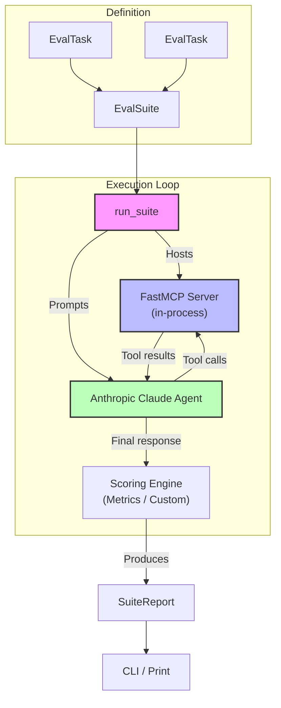
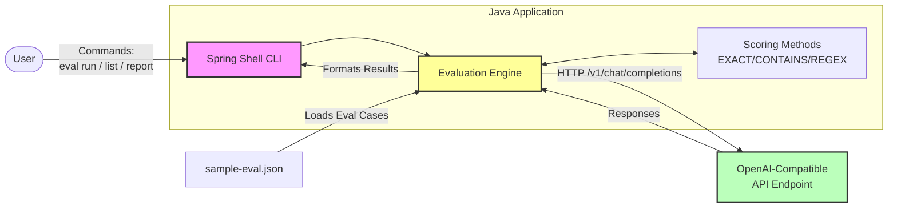

# Consequence Architecture

This document visualises the architecture of the **consequence** evaluation toolkit, which consists of two distinct components: the Python MCP-backed evaluator and the Java CLI evaluator.

## Python: MCP-Backed Agent Evaluation

The Python component is designed to evaluate Anthropic Claude agents interacting with Model Context Protocol (MCP) servers. It orchestrates the entire flow from defining tasks to interacting with the agent and scoring the final output.

## Java: Agent Evaluation CLI

The Java component acts as a lightweight standalone execution engine (CLI) built with Spring Shell. It can evaluate any generic OpenAI-compatible chat-completions API using definitions loaded from a static JSON file.

