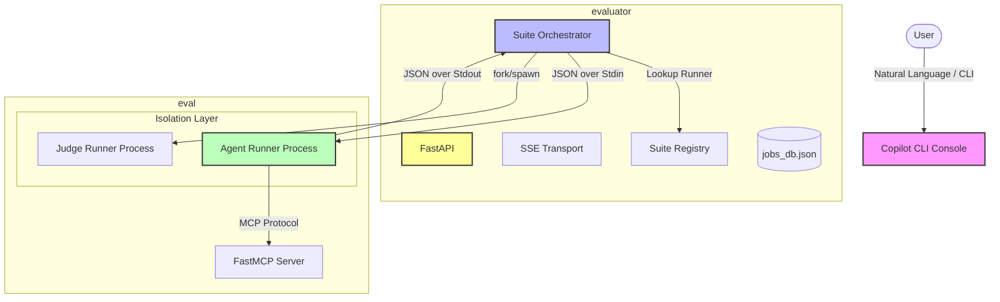
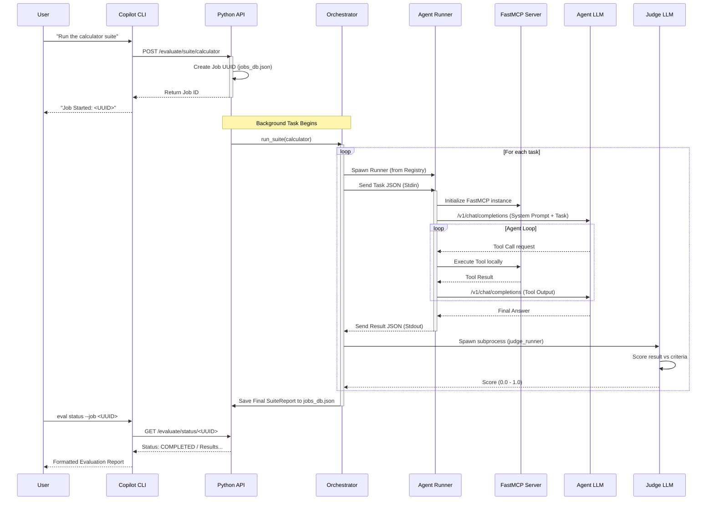
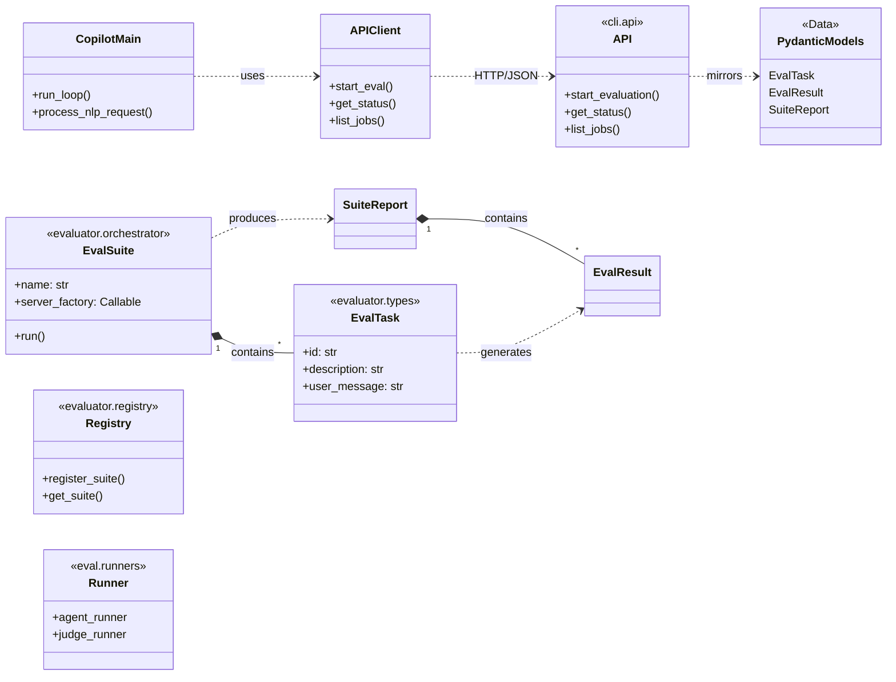

This document visualises the architecture of the **consequence** evaluation toolkit. The system uses a unified control plane (Python Copilot CLI) that orchestrates a specialized Python Evaluation Engine capable of hosting and testing Model Context Protocol (MCP) agents.

## Component Overview

The architecture is divided into a high-level **Control Plane** (Python Copilot CLI) and a low-level **Execution Engine** (Python Evaluation Engine).

## Evaluation Sequence

The following diagram illustrates the low-level sequence of events when starting an evaluation job from the Copilot CLI.

## Class Relationships

The following diagram shows the logical relationships between the Python Copilot control plane and the Python execution engine's data models.

## Design Principles

1.  **Process Isolation**: Every agent task runs in its own isolated Python process. This ensures that the global state of one MCP server doesn't "leak" into another task's evaluation.
2.  **Stateless Control**: The Copilot CLI is completely stateless. It communicates with the Python engine over a REST API, making it easy to swap the CLI for a web UI or CI/CD runner in the future.
3.  **Persistence**: Job statuses are stored in a simple JSON flat-file. This provides persistence across container restarts while remaining lightweight enough to run on single-core CPU environments.
